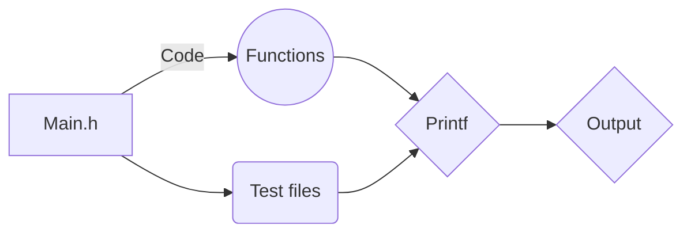

# _Printf

_printf is a C library for dealing with string format.It handles the following conversion specifiers:

- c
- s
- %
- i
- d

## Installation

Access Github and request a pull, [link](https://github.com/allthatgroove89/holbertonschool-printf/pulls) to install to get function package.

## Function Prototypes

All function prototypes used to compile _printf() are included in the header file:

- int _printf(const char *format, ...);
- void handle_percent(int *count);
- void handle_char(va_list args, int *count);
- void handle_string(va_list args, int *count);
- void handle_int(va_list args, int *count);

## Contributing

Pull requests are welcome. For major changes, please open an issue first
to discuss what you would like to change.

Please make sure to update tests as appropriate.

## Flowchart

## Authors and acknowledgment

## Saul Vera Echevestre and Ginna Figueroa Rodriguez, github [link](https://github.com/allthatgroove89/holbertonschool-printf)
