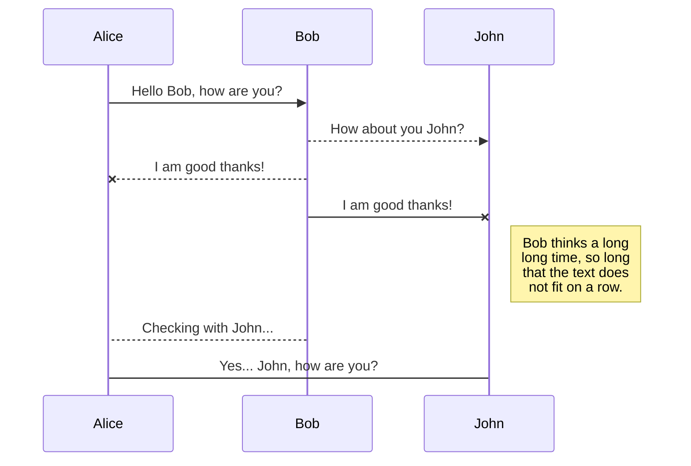
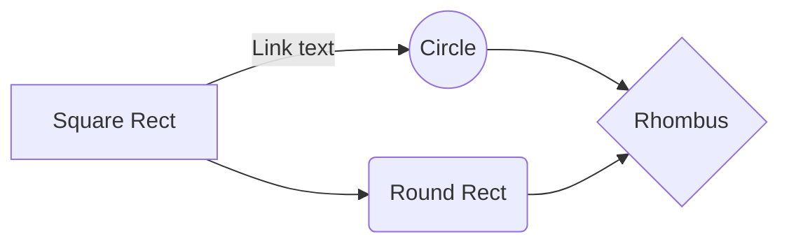

## Printf Readme

# _Printf

_printf is a C library for dealing with string format.It handles the following conversion specifiers:
  - c
- s
 - %

## Installation

Access Github and request a pull, [link](https://github.com/allthatgroove89/holbertonschool-printf/pulls) to install to get function package.

```bash
int _printf(const char *format, ...);
```

## Outputs

```C
int _printf(const char *format, ...);

# _printf("Character:[%c]\n", 'H')
   returns Character:[H]


# _printf("String:[%s]\n", "I am a string !");
   String:[I am a string !]


# len = _printf("Percent:[%%]\n");
   Percent:[%]


```

## Contributing

Pull requests are welcome. For major changes, please open an issue first
to discuss what you would like to change.

Please make sure to update tests as appropriate.

## Flowchart


You can render UML diagrams using [Mermaid](https://mermaidjs.github.io/). For example, this will produce a sequence diagram:



And this will produce a flow chart:



## Authors and acknowledgment

## Saul Vera Echevestre and Ginna Figueroa Rodriguez, github [link](https://github.com/allthatgroove89/holbertonschool-printf).
